# Sprint 0 | intro minor web design & developments
Ontwerp en bouw een persoonlijke website waarmee je jezelf voorstelt, waarmee je jouw startniveau overstijgt en waarmee je jouw doelen voor de minor presenteert.

## Week 1 | 03-02-2026 dinsdag
### Wat heb ik vandaag gedaan?
Vandaag hadden we de kick off en was ik begonnen met het brainstormen van ideeën voor mijn persoonlijke website. Morgen ben ik van plan om te beginnen met de eerste opzet van mijn site. 

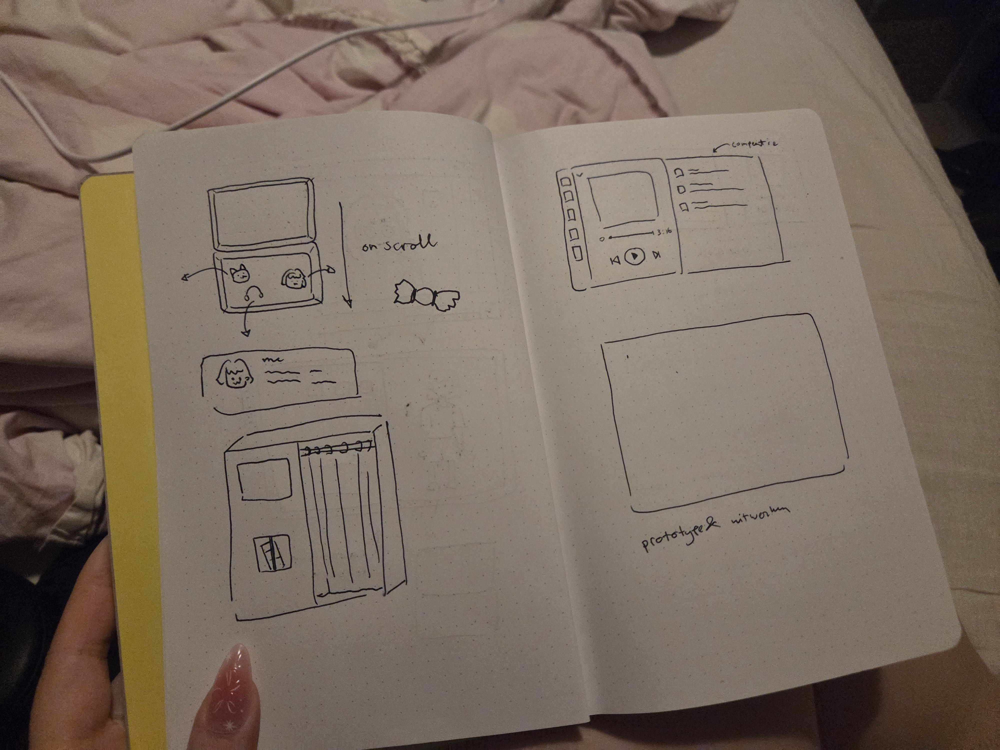

## Week 1 | 04-02-2026 woensdag
### Wat heb ik vandaag gedaan?
Vandaag heb ik een begin gemaakt aan mijn site, ik ben vooral bezig geweest met de animaties uitproberen en een eerste opzet maken. Dit werkte wel soepel, maar ik heb dus een idee dat het begint met een gesloten doosje en ik heb al een css animatie staan op het doosje waardoor de opacity tegenwerkt met de opacity van de animatie. 

Dit was alles waar ik aantoegekomen was vandaag.

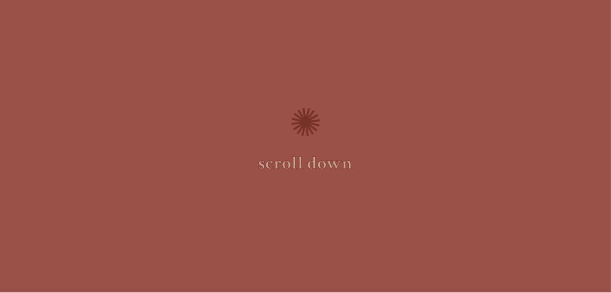
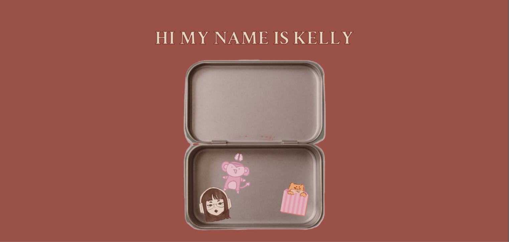

## Week 1 | 05-02-2026 donderdag
### Wat heb ik vandaag gedaan?
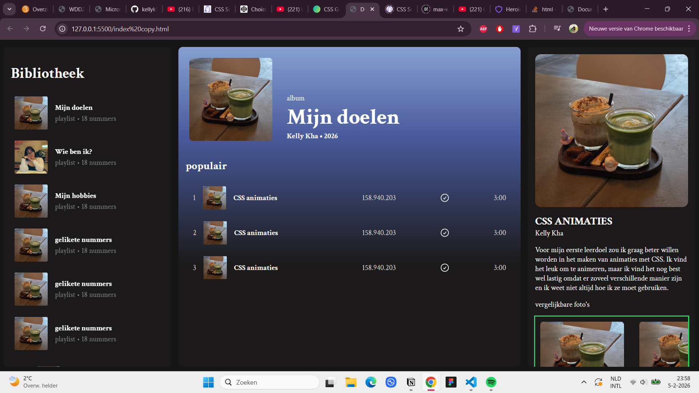
9:30 - 10:00 opstarten

10:15~ 11:00 workshop

Ik heb de theming lesje van vasilis gevolgd en daarna ben ik verder gaan werken aan mijn website, maar ik zag het niet meer zitten met mijn huidige site. Dus ik ben teruggegaan naar een ander concept: spotify achtig. Hier heb ik de rest van de dag aangezeten en ik heb de basis kunnen neerzetten vandaag. 

### Hoe lang duurde het?

Ik was in de ochtend nog een tijdje aan het knoeien met mijn oude site en rond 12/13 was ik aan de slag gegaan met de nieuwe site en heb ik 2 a 3 uurtjes eraan kunnen zitten

### Wat heb ik geleerd?

Ik heb weer grid opnieuw geleerd

### Wat ga ik morgen doen?

ik ga werken aan de muziek slider aan de onderkant morgen en ben ook van plan om in de 3e vak een infinite automatic scroller te maken

## Week 1 | 05-02-2026 vrijdag + reflectie
### Wat heb ik vandaag gedaan?
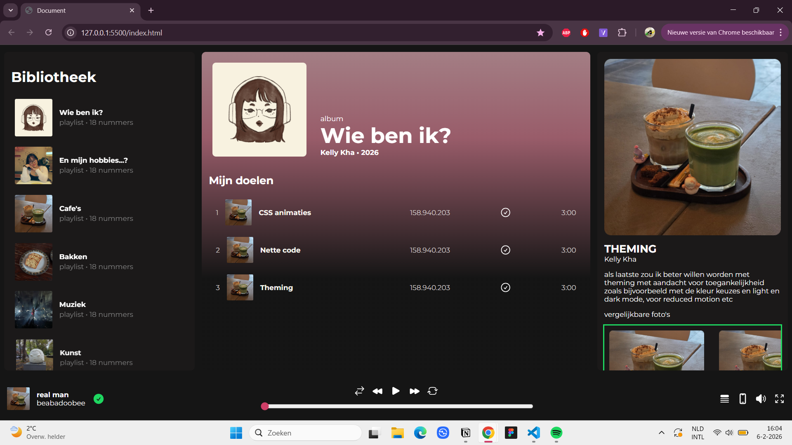
ik heb vandaag de content aan de rechterkant vervangen en ben ik verder gegaan met het functioneel maken van mijn site. De doelen zijn nu klikbaar en als je erop klikt dan verandert de rechterkant naar het juiste onderwerp. 

Ook heb ik de player aan de onderkant toegevoegd en de styling een beetje aangepast. 

### Hoe lang duurde het?
Van 9 tot 13 dus 4 uurtjes

###  Wat ga ik morgen doen?
Morgen ben ik van plan verder te gaan met theming aangezien we voor de opdracht twee thema's moesten hebben.

### Reflectie
Deze week was het weer heel erg inkomen voor mij, want ik heb al een hele lange tijd niet meer gecodeerd. Toen ik begon wist ik het allemaal even niet meer hoe ik het moest aanpakken en versliep het heel sloom voor mij. Na het veranderen van mijn idee ging het toch wel ietsjes beter en kon ik wel gelijk aan de slag. Ik heb nog wel een beetje het gevoel alsof ik iets mis, maar daar gaan we volgende week naar kijken.

## Week 2 | 09-02-2026 maandag
### Wat heb ik vandaag gedaan?
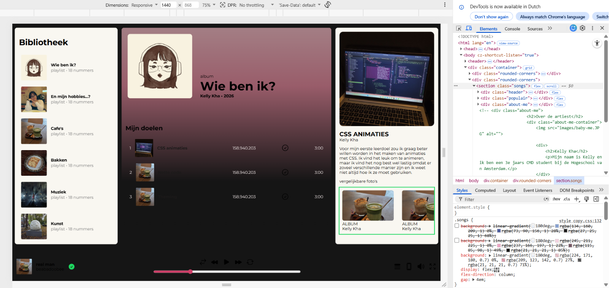
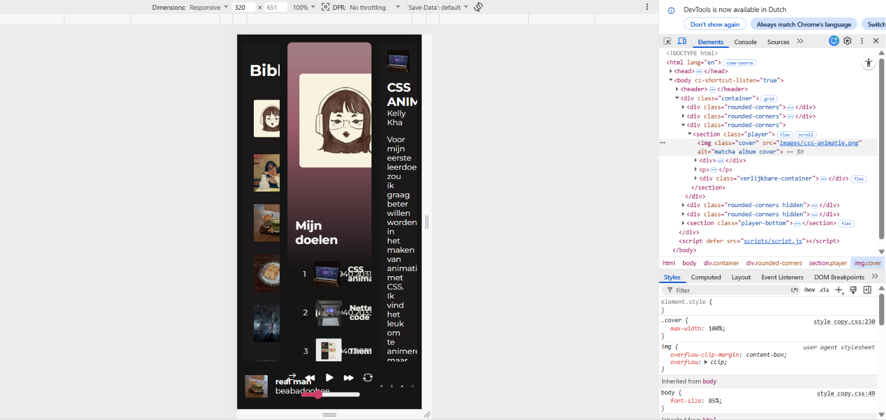
Ik heb vandaag een light en dark mode toegevoegd en dat duurde wel lang, want het is wel nieuw voor mij en vooral met een gradient en de hover ging niet soepel. Verder heb ik over de artiest en fans houden van toegevoegd. Wat heel leuk was van de extra eis over de API sluit precies aan met 'de fans houden ook van' idee om klasgenoten eraan toe te voegen.

Ik heb dus vandaag iets geleerd over theming!

### wat nog doen tot donderdag?
api erin zetten en de site responsive maken

## Na de herkansing
Ik was helaas afwezig de rest van het project, dus dit is wat ik nog heb gedaan voor de herkansing. Er waren nog wel een paar dingen die ik moest aanpassen en toevoegen.

### Wat heb ik aangepast?
#### Light and dark mode
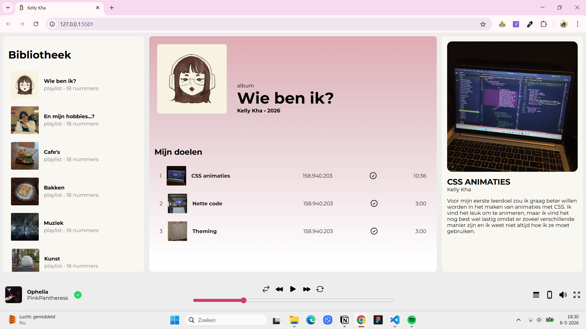
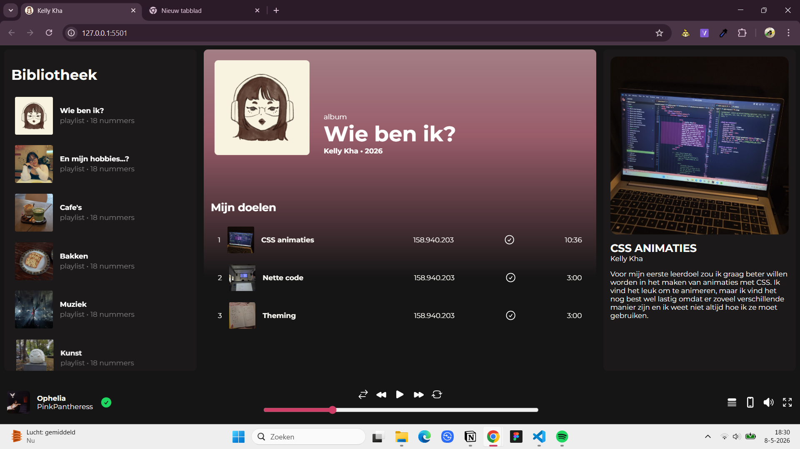

#### Responsive design
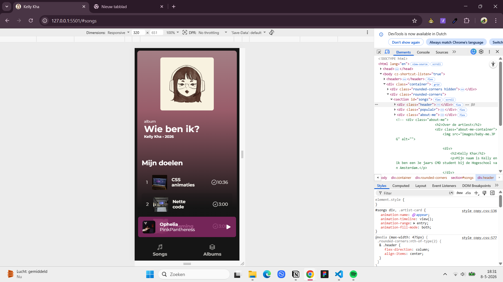
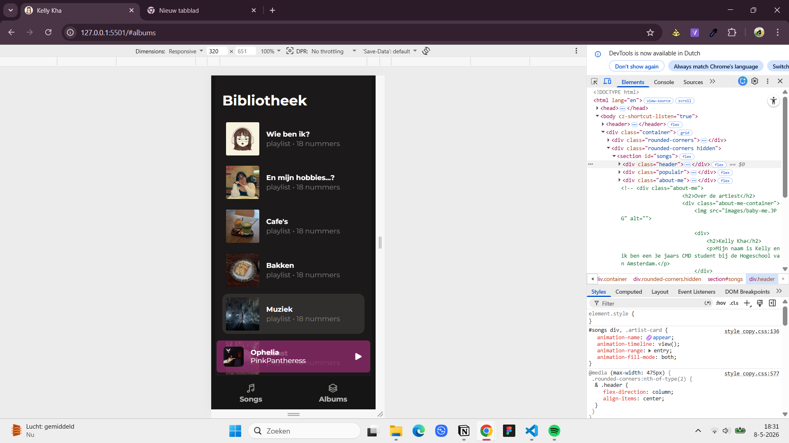

Voor de mobile versie heb ik de site verdeeld in 2 delen: een sectie voor de doelen en klasgenoten en een sectie voor de albums, mijn hobbies. Het blijft nogsteeds 1 pagina, maar wat ik heb gedaan is de sections met de javascript een class hidden gegeven. 

#### API
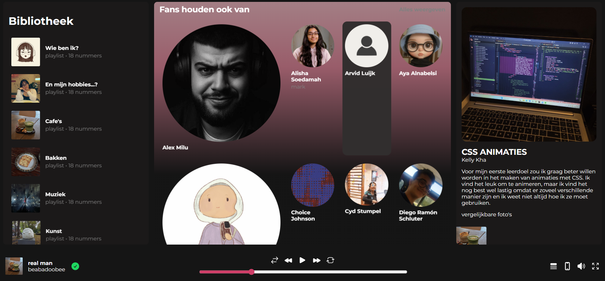
Ik had wel wat moeite met het inladen van de api, maar dit kwam dus door de fav tag. Ik wilde die eerst ook oproepen, maar nadat ik die regel had verwijderen gedraagde alles zich normaal. 

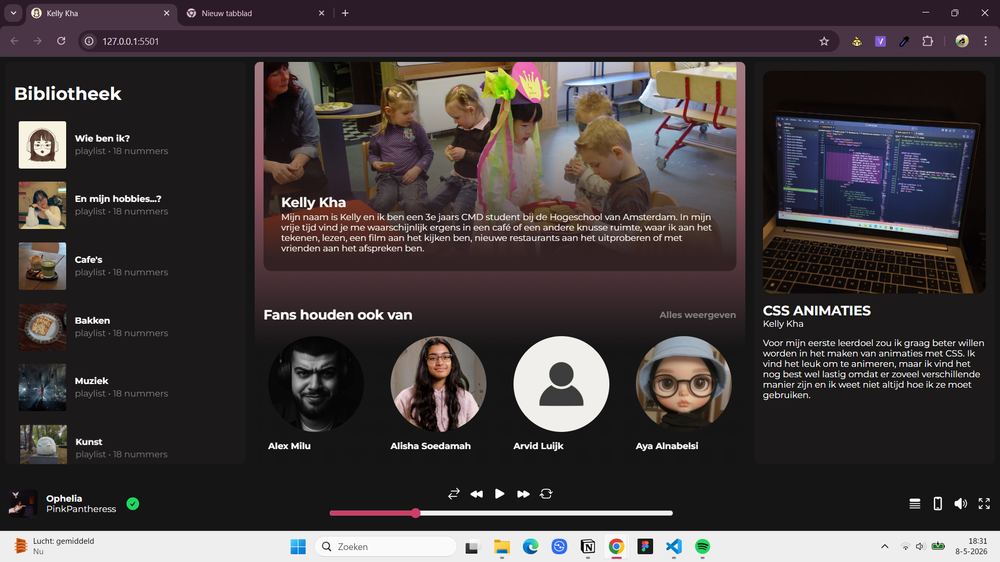
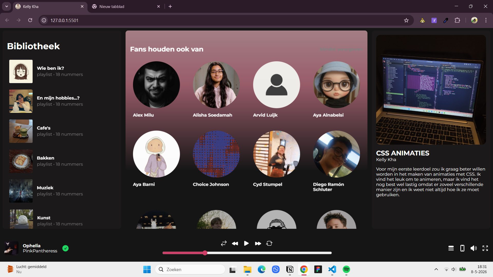

#### Reflectie op het project
Deze site sluit wel heel erg aan op mij, omdat ik bijna altijd spotify ook open heb. Ik denk niet dat dit perse heel erg exclusief is voor mij, omdat veel mensen wel dagelijks spotify gebruiken. Ik denk wel dat de manier hoe ik de content heb toevoegd wel een leuk idee was! 

Dit project was weer heel erg inkomen voor mij, maar ik vond het wel heel leuk om te doen en ik ben ook heel blij met hoe het eruit ziet.

### Bronnenlijst
- https://claude.ai/chat/f6fc1d82-5bcb-46ed-be68-ef7d31d1a6c0
- https://www.youtube.com/watch?v=EiNiSFIPIQE&t=5s
- https://www.youtube.com/watch?v=0TnO1GzKWPc

